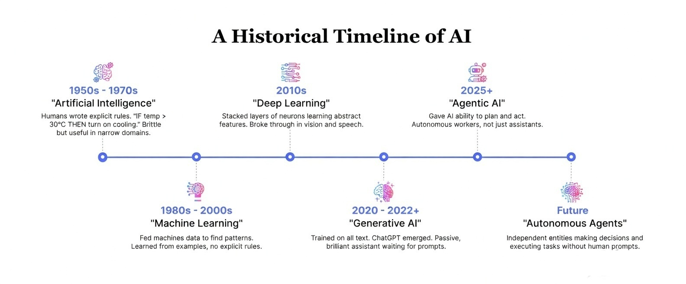
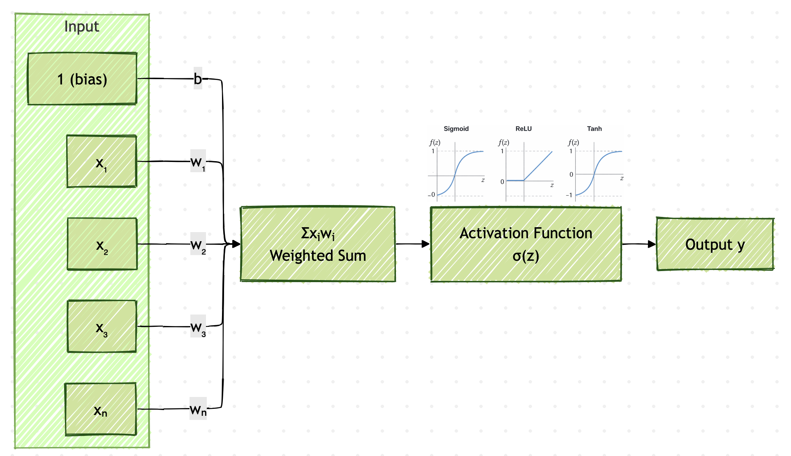
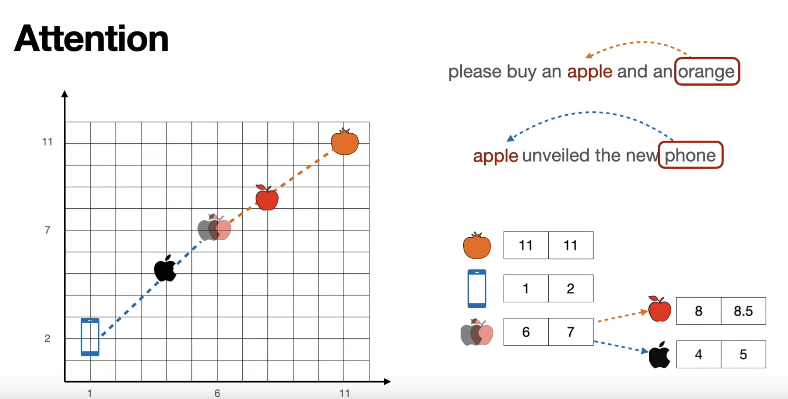
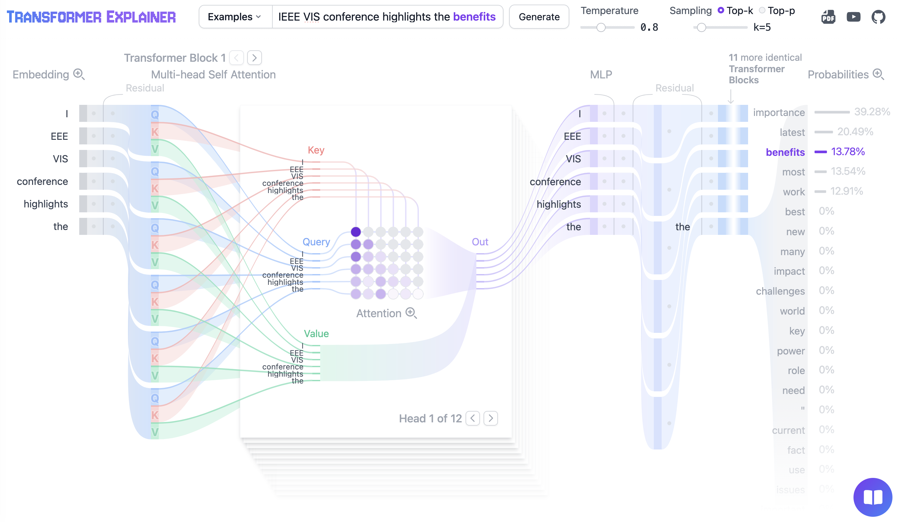
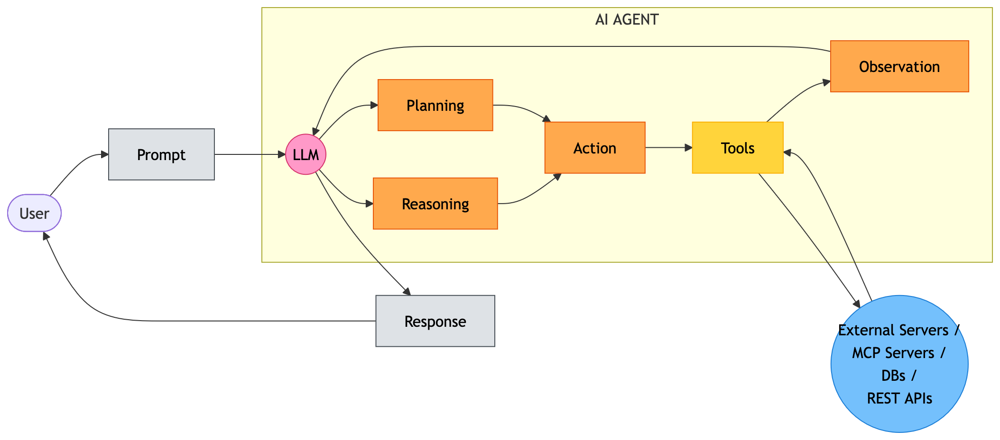
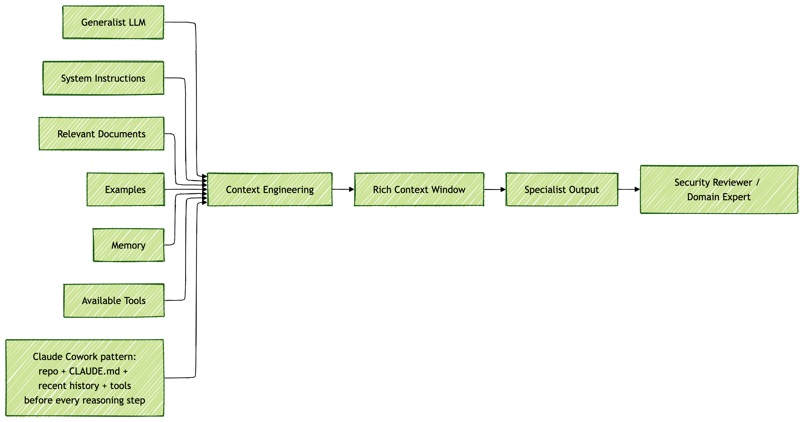
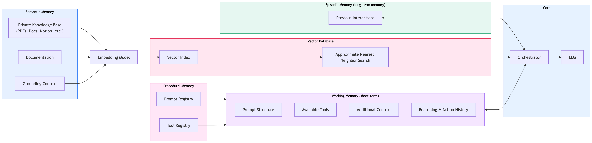
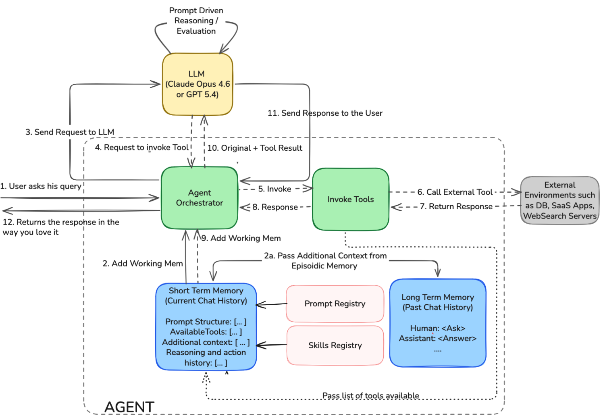

# From Chatbots to Claude Code: Everything You Need to Know About Agentic AI

*How few AI announcements from Anthropic erased billions from global markets — and what it tells us about where technology is headed*

---

## The Day the Markets Panicked

January 30, 2025. Indian stock markets opened to a bloodbath.

**Infosys. Wipro. TCS. HCL Technologies.** In a matter of hours, ₹90,000 crore — nearly $11 billion — evaporated from their combined market caps. Investors weren't responding to a recession, a geopolitical shock, or a quarterly miss. They were responding to *three product announcements* from Anthropic, the AI company behind Claude.

The announcements that triggered the panic:

**1. Claude Cowork** — an agentic AI that doesn't just write code when asked. It independently reasons about architecture, writes files, runs tests, reads documentation, and iterates — like a fully autonomous junior engineer who never sleeps.

**2. Claude's COBOL Migration Capability** — the ability to read legacy COBOL code (the 60-year-old language that powers the world's banks, insurance companies, and government systems) and migrate it to modern Java or Python. IBM Global Services and Accenture charge *hundreds of millions of dollars* annually for exactly this work. Claude can do it in hours.

**3. Claude Code Security Features** — automated vulnerability scanning, threat modeling, and security code review. Companies like Okta, CrowdStrike, and Zscaler have built billion-dollar businesses around security services and tooling that skilled human analysts perform. Agentic AI now automates significant parts of this work.

The market asked a simple question: *If AI can write, migrate, and audit code autonomously, what exactly are we paying all these people to do?*

That question, uncomfortable as it is, deserves a real answer. And to give it, you need to understand what's actually happening under the hood. Because this isn't just about jobs. It's about a fundamental shift in how software gets built — and how intelligence itself works.

Also you will be wondering as to why now. LLMs are present since June 2020. GPT-4 came in March 2023. What has changed after 2023? What is making AI to think, plan, and act like human?

This article covers these important questions.

Let's go back 70 years.

---

## 70 Years in 5 Minutes: The AI Evolution



*Fig 1: Seven decades of AI evolution, from hand-coded rules in the 1950s to autonomous reasoning agents today.*

In 1956, a group of researchers at Dartmouth College believed they could solve "artificial intelligence" in a single summer. They were wrong about the timeline. But they were right about the destination.

Here's the arc:

**Artificial Intelligence (1950s–1970s):** Humans wrote explicit rules for machines to follow. "IF temperature > 30°C THEN turn on cooling." Useful in narrow domains. Completely brittle outside them. Chess engines beat grandmasters — but couldn't make a cup of tea.

**Machine Learning (1980s–2000s):** Instead of writing rules, we fed machines *data* and let them find the patterns. Show a system 50,000 loan applications and their outcomes, and it learns to predict defaults better than any rule a human could write. No explicit programming — just optimization. Machines learned from examples.

**Deep Learning (2010s):** Stack many layers of "neurons" on top of each other. Each layer learns increasingly abstract features. The first layer of a vision network might detect edges. The next detects shapes. The next detects objects. With enough layers, enough data, and enough computing power — deep learning broke through in image recognition, speech, and eventually language.



*Fig 2: A single artificial neuron: inputs are weighted, summed, passed through an activation function, and produce an output. Stack billions of these across dozens of layers — that's Deep Learning.*

**Generative AI (2020–2022):** Apply deep learning at an unprecedented scale to human language. Train on essentially all text ever written. The result: ChatGPT. Models that could write essays, debug code, answer questions, generate images — all from natural language instructions. The world felt AI for the first time. One million users in five days.

But Generative AI had a fundamental nature: **it was passive.** It waited for your prompt. It generated a response. Then it sat idle until you typed again. Brilliant, but not autonomous. A genius assistant, not an independent worker.

To understand why the next step — Agentic AI — is different in kind, not just degree, we need to understand what made these models work in the first place.

---

## The Architecture That Changed Everything: Transformers

In 2017, eight researchers at Google published a paper with a modest title: *"Attention Is All You Need."*

Before this paper, language models processed text sequentially — word by word, like reading a sentence one letter at a time with your finger. They forgot context easily. They couldn't understand long-range relationships between words.

The **Transformer architecture** changed this with a radical idea: what if every word could look at every other word *simultaneously*?



*Fig 3: The attention mechanism. For a given sentence, every word simultaneously calculates how relevant every other word is to understanding its meaning. The grid shows attention weights — "it" attends heavily to "pizza" because that's what it refers to.* Image Source: https://www.youtube.com/@SerranoAcademy [Luis Serrano's Serrano Academy]

This mechanism — called **self-attention** — lets the model understand context. The word "bank" in "I bank with HDFC" and "I sat on the bank of the river" gets completely different representations, because the surrounding words are different. The model understands *context*, not just vocabulary.

Scale this architecture. Add billions of parameters. Train on trillions of tokens of text. You get GPT-4. You get Claude. You get Gemini. These are **Large Language Models (LLMs)** — and they're genuinely remarkable.

But they have a deep, structural problem.

---

## The Inconvenient Truth: What LLMs Cannot Do



*Fig 4: LLMs generate probabilistic answers from training data. In this image, it predicts "benefits" as next word for the sentence "IEE VIS conference highlights the". They're impressive — but they have hard architectural limits that no amount of prompt engineering can fix.* Image Source: https://poloclub.github.io/transformer-explainer/

LLMs are frozen in time. They cannot:

- **Access current information.** Their knowledge has a cutoff date. Ask GPT-4 about something that happened last month — it will either say it doesn't know, or worse, confidently hallucinate an answer.

- **Remember you.** Every conversation starts fresh. Tell ChatGPT your name, your preferences, your project context — it forgets all of it the moment the session ends.

- **Take actions.** An LLM can *describe* how to send an email. It cannot *send* one. It can write code. It cannot *run* it. It observes the world through text; it has no hands.

- **Verify its own output.** LLMs generate the next most probable token. They don't "know" when they're wrong. They produce confident answers to questions they should answer with "I don't know."

- **Access your data.** An LLM trained in 2024 knows nothing about your company's codebase, your customer database, or your internal documents — unless you explicitly provide that context.

These aren't bugs. They're architectural facts. And they're exactly why, despite the ChatGPT revolution, enterprise AI deployments kept failing. Companies would demo a chatbot that sounded brilliant, deploy it to production, and discover it hallucinated facts, couldn't access real-time data, and forgot context between sessions.

The industry had a choice: accept these limitations, or engineer around them.

---

## Enter Agentic AI: Machines That Think, Plan, and Act

The solution to above problem is: 1. Add reasoning capability to LLM. 2. Build a *system around* the LLM, which is Agentic AI.



*Fig 5: An Agentic AI system. The LLM is the "brain" — it reasons and decides. But it's surrounded by tools it can call, memory systems it can query, and an external environment it can act upon. This is what separates a Claude Code from a chatbot.*

**Agentic AI** is an LLM with reasoning capability that is connected to four things it previously lacked:

**Memory** — so it can remember what happened before, retrieve relevant context, and build on past interactions rather than starting fresh every time.

**Tools** — so it can actually *do* things: search the web, read files, run code, call APIs, query databases, send messages.

**Planning** — so it can break complex goals into steps, execute them in sequence, handle failures, and try alternative approaches.

**Environment awareness** — so it understands where it is (your codebase, your cloud environment, your company's systems) and can navigate intelligently.

**LLM with Reasoning Capability** - LLMs are good at predicting next word based on terabytes of text data on which it was trained. But when it has to solve a complex problem that needs multi-step solution, it could not act like a human. When I am faced with bigger problem, I break it down into smaller problems and solve it. For example, when I had to write a script to extract key idea from technical youtube video, I broke down this into following function/modules and implemented the python script:

1. Find the library that supports downloading video from youtube (https://github.com/yt-dlp/yt-dlp)
2. Find the library that can extract audio from video (ffmpeg)
3. Find the AI model that converts speech to text (AssemblyAI) and learn about its API
4. Use Claude APIs / OpenAI APIs to summarize extracted text and extract key ideas from the text
5. Generate a md file or html file

Whereas if I have to count number of lines in a text file, I will just execute "wc -l <filename>" without having to come up with complex logic. The former is LLM with reasoning. The latter is LLMs - early generation LLMs. LLMs were given the ability to reason and break down complex problems into smaller actions using techniques such as Reinforcement Learning, Fine-tuning and etc. For more details on reasoning LLMs, refer https://magazine.sebastianraschka.com/p/understanding-reasoning-llms.

This transforms AI from a *question-answering system* into a *work-doing system*. That's the distinction the market understood on January 30, 2025.

---

## The Four Building Blocks of Agentic AI

So what exactly makes Agentic AI work? Four engineering innovations — each solving a specific limitation of raw LLMs.

### 1. Context Engineering: Turning a Generalist into a Specialist

A raw LLM knows about everything, but not specifically about *your* domain. Context Engineering is the practice of assembling a rich, precise context window before every LLM call:

- **System instructions**: "You are a senior Python engineer. You follow PEP8. You write tests before implementation. Here are our coding standards."
- **Relevant documents**: Your API documentation, architecture diagrams, database schemas — fed in as needed.
- **Examples**: Show the model two or three examples of the output format you want.
- **Memory**: Past conversations, retrieved by semantic similarity.
- **Available tools**: A list of what the agent can call.



*Fig 6: The six pillars of Context Engineering: prompting techniques, long-term memory, agents, query augmentation (RAG), control flow, and tools. Together they take a general-purpose LLM and create a specialist that knows your domain.*

The same GPT-4 that gives you a generic answer about security vulnerabilities, when given your codebase, your threat model, and your company's security policies as context — becomes a specialist security reviewer. **The model hasn't changed. The context has.**

This is why Claude Cowork is so powerful. It assembles extraordinary context: your entire repository structure, your CLAUDE.md instructions, recent conversation history, and a rich set of available tools — before every single reasoning step.

### 2. Memory: Four Kinds, Each Doing a Different Job

Human experts are valuable because they remember. They remember what you tried last time, what worked, what your preferences are, what your domain requires. Agentic AI replicates this with four types of memory:



*Fig 7: The four-tier memory stack. Working memory is the active conversation. Episodic memory stores past interactions, retrieved by vector similarity. Semantic memory holds external knowledge bases. Grounding context provides current session documents. Together they give an agent genuine continuity.*

- **Working memory**: The active conversation window — what's being discussed right now.
- **Episodic memory**: Past conversations, stored as vector embeddings and retrieved by semantic similarity. When you come back tomorrow and say "continue where we left off," the agent can find the relevant past context.
- **Semantic memory**: External knowledge — documentation, APIs, domain knowledge — that the agent can query as needed.
- **Procedural memory**: Instructions about *how* the agent should behave — like the CLAUDE.md file in your repository that tells Claude Code your project's conventions, preferred patterns, and constraints.

### 3. Function Calling and Tool Calling: Giving AI Hands

An LLM can describe how to send an email. **Function calling** lets it actually send one.

The model is given a list of available functions — `send_email(to, subject, body)`, `query_database(sql)`, `run_code(language, code)`, `search_web(query)` — along with descriptions of what each does.

When the model needs to use one, it doesn't just *describe* using it. It outputs a structured JSON request: `{"function": "query_database", "sql": "SELECT * FROM orders WHERE status='pending'"}`. The calling code executes this, returns the result, and the model continues reasoning with the new information.

This is the core of the **ReAct loop** (Reasoning + Acting) that powers every production agent:

```
1. THINK — Reason about what to do next
2. ACT   — Call a tool (function, API, code executor)
3. OBSERVE — See the result
4. Repeat until the goal is achieved
```

Claude Code runs this loop dozens of times per task. Each iteration, it reads files, runs code, checks outputs, adjusts its approach — behaving like a developer thinking through a problem at a terminal.



*Fig 8: The AI Agent using short term memory, long term memory, tools, and LLM Reasoning to solve simple and complex problems.*


### 4. Model Context Protocol (MCP): The USB Port for AI

Here's the problem with tools: every AI system was building its own integrations. Anthropic had its own way to connect to tools. OpenAI had another. Each tool integration was custom-coded, fragile, and non-portable.

In November 2024, Anthropic released an open standard called the **Model Context Protocol (MCP)**. Think of it as USB for AI.

Before USB, every device needed its own proprietary cable. After USB: one standard connector, any device works with any computer. Before MCP: every AI needed custom code to connect to every tool. After MCP: any AI connects to any tool through a single standard protocol.

This is why the security companies felt the pressure alongside the IT outsourcing firms. Security workflows — code scanning, penetration test reporting, compliance auditing, vulnerability triage — can now be wired to any MCP-capable AI agent through standardized MCP servers. The expensive human-labor component of these workflows becomes automatable.

---

## What This Actually Means

Let's return to today.

The markets were right that something fundamental has changed. The question "why do you need thousands of programmers for repetitive implementation work?" has a harder answer than it did two years ago.

But here's what the markets missed: **Agentic AI doesn't just replace work. It creates new work.**

Every wave of automation in history — spreadsheets replacing manual bookkeeping, the internet replacing physical encyclopedias, cloud computing replacing on-premise infrastructure — destroyed certain roles and expanded the total surface area of what humans could build and explore.

The COBOL migration example is instructive. Yes, Claude can now migrate COBOL to Java in hours instead of months. But the freed engineering capacity can be directed at the *next* problem: modernizing the systems that sit around the COBOL core, improving the interfaces, building new capabilities that weren't feasible before. The pie gets bigger.

The engineers who thrive in this era are those who:

- Understand how to *orchestrate* agentic systems, not just write code
- Can architect systems that use AI as a component, not a replacement
- Focus on the genuinely hard problems — systems design, non-functional requirements, novel problem-solving — that require human judgment
- Learn to work alongside autonomous agents as a force multiplier

The engineers in danger are those still optimizing for writing the most lines of code. That particular skill is becoming a commodity.

---

## The Bottom Line

Seventy years of AI research converged on a single insight: intelligence isn't about storing knowledge — it's about **using** knowledge to act in the world.

LLMs gave us the knowledge. Agentic AI gives us the action.

The ReAct loop — Think, Act, Observe, Repeat — running inside Claude Cowork, Claude Code, and every modern agentic system, is a primitive but functional approximation of how experts actually work. Not by knowing everything, but by reasoning, using tools, observing outcomes, and iterating.

That's why the Indian IT stocks moved. That's why security companies are repricing. That's why COBOL modernization consultancies are renegotiating their value propositions.

And that's why understanding this architecture — not at a buzzword level, but at a *how does it actually work* level — is one of the most important things a technology professional can do in 2025.

The companies and engineers who understand Agentic AI deeply will build the tools of the next decade.

The ones who don't will wonder why the market moved without them.

---

*Satishkumar Venkatasamy is Vice President of Engineering at Citrix, with 30+ years building enterprise software at Oracle and Citrix. These are excerpts from the presentation that I made in a college as well as the presentation that I am going to make to my colleagues at Citrix.*

*#AgenticAI #AI #LLM #Claude #MCP #FunctionCalling #ContextEngineering #Transformers #Career #TechLeadership #BuildInPublic*
